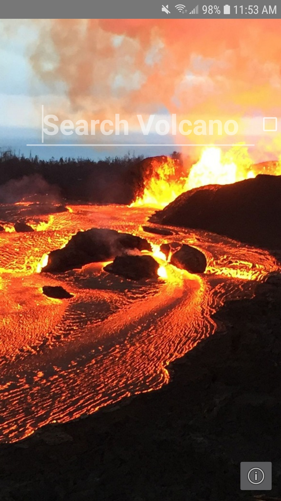
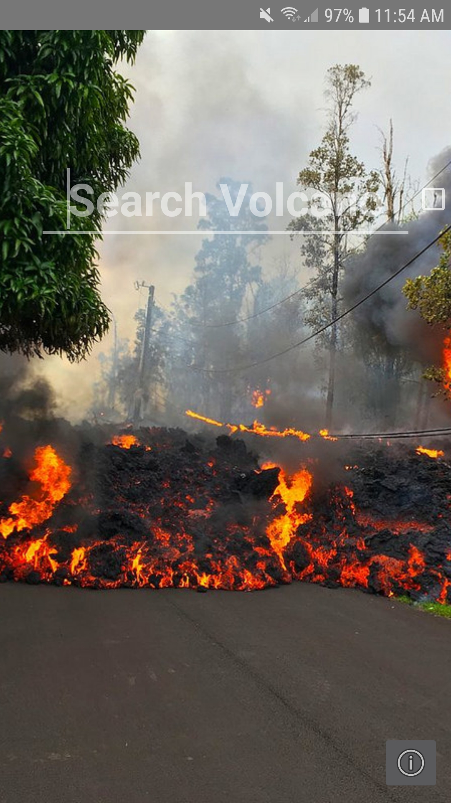
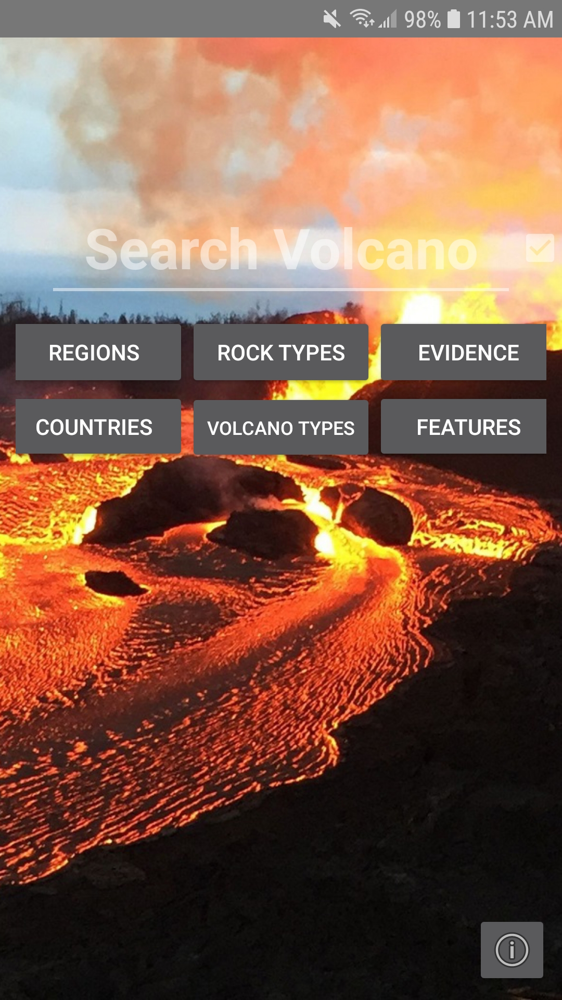
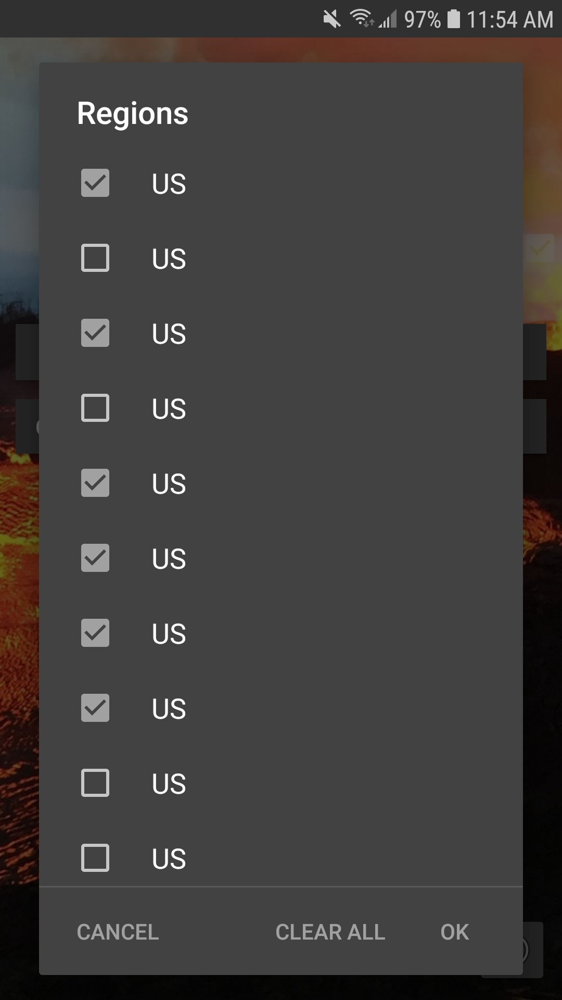
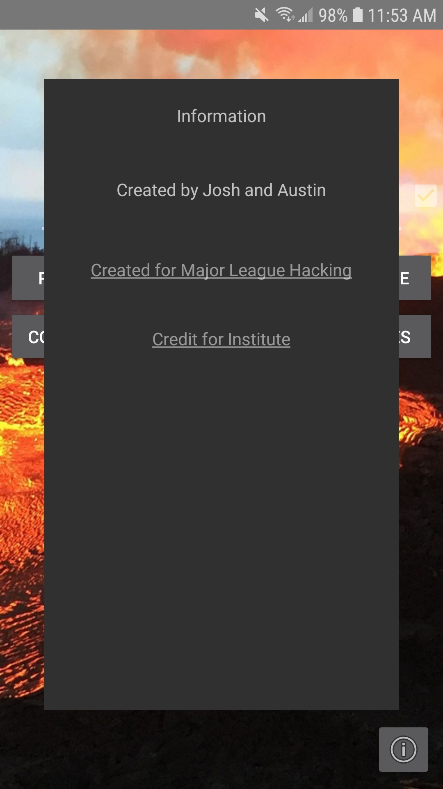

# VolQuery
An Android application that allows the user to search for real volcanoes by country, evidence, features, region, rock type, volcanoe type. Information pertinent to that volcanoe and an image would then be displayed to the user.

## Credit
This was made during the Iowa State University 48 hour hackathon competition in October 2018. It was a Major League Hacking event.

Austin Rognes wrote the front-end android application using Android Studio.

Josh Heiser wrote a backend database that would filter and deliver requested information. 

We used some of the volcanoe information from the online database [Smithsonian Institution](http://volcano.si.edu/).
It had in-depth information on coordinate systems and lots of other information we did not use in our database.

## What I Learned
This was my first time working with a team on a software project. It was a good first experience that made me understand how important it is to have everyone gainfully employed in doing the tasks that they want to do.

I had never used Android Studio or Git before this.

Over the 48 hours, I learned how to implement many features from Android Studio. I first loaded in background images in that change each time the application is opened. Next, I created a credit menu panel that showed up on a button press, and some text with links to credits. I added a search box and a toggle button next to it to enable filters. I created 6 filter buttons that each would pop up with a list of the associated filter such as Country. The last thing I did was make the lists save you selection of filters and have clear and cancel functionality.

## Breif Story
We split front-end and backend between Austin and Josh. Everything was going slowly, but to plan. When Josh got the database done he branched the front-end so he could make it communicate with the backend. Once that was working we were in the final half-hour, I pushed the last filter menu I made, he merged his branch, and our files corrupted. It even managed to corrupt my android studio which I reinstalled later.  :(

Moral of the story is to learn git

## Screenshots
Luckily I still have the last functioning version of this application running on my phone!

                
